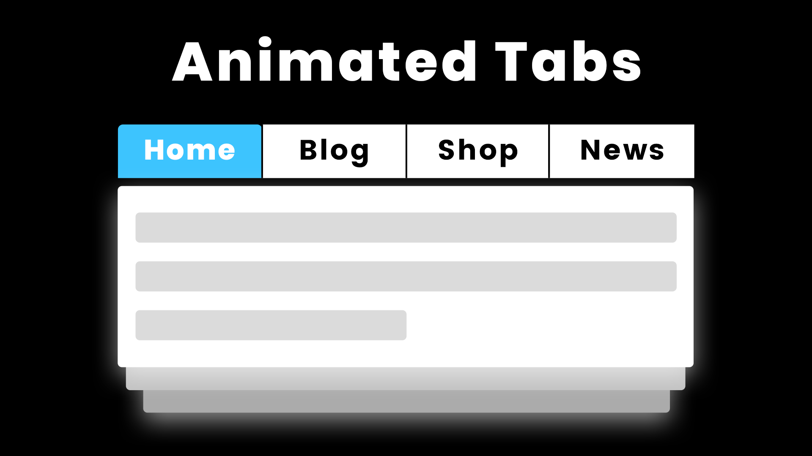

# Animated Tabs Using Only HTML CSS | Create Tabs Using HTML CSS

Youtube Tutorial Link: https://youtu.be/cyQVk2msGYA

The "Animated Tabs Using Only HTML and CSS" tutorial teaches you how to create interactive, animated tab navigation without the need for JavaScript. This project focuses on using CSS for smooth transitions and styling, allowing users to switch between different content sections with a simple click. It's a clean and efficient way to organize content in a visually appealing layout using pure HTML and CSS.
